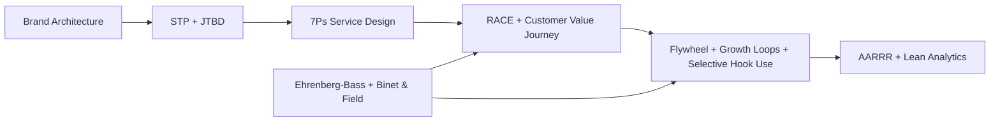
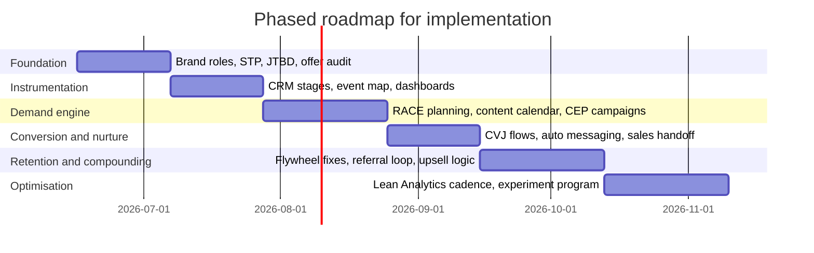

# Proven Marketing Frameworks for a Multi-Brand Fitness and Coaching Business

## Executive summary

No single framework is strong enough to run a multi-brand service business on its own. The most reliable approach is to combine portfolio strategy frameworks, demand-generation frameworks, customer-journey frameworks, retention frameworks, and measurement frameworks into one operating system. For your mix of a founder-led personal brand, a local gym brand, a transformation coaching brand, and campaign or product launches, the strongest core stack is: **Brand Architecture + STP + JTBD** to decide brand roles, audiences, and offers; **7Ps** to make the service experience match the promise; **Ehrenberg-Bass mental and physical availability + Binet & Field long/short** to guide broad-reach growth and budget balance; **RACE + Customer Value Journey** to operationalise acquisition and nurture; **Flywheel + Growth Loops** to improve retention, referrals, and compounding growth; and **AARRR + Lean Analytics** to keep measurement disciplined and decision-oriented. citeturn26view0turn26view1turn27view0turn6view10turn27view1turn6view0turn36view0turn16view0turn6view2turn21view0turn6view3turn22view0turn13view0turn6view7turn31view0turn6view4turn12view0turn6view8

The frameworks in this report are not equally evidence-backed. The strongest empirical bases in your shortlist are **Ehrenberg-Bass**, which is grounded in repeated observations of buying behaviour, mental availability, physical availability, and category entry points, and **Binet & Field**, which is based on years of IPA effectiveness case data. **STP**, **7Ps**, and **JTBD** also have deeper academic or theory roots than most practitioner models. By contrast, **RACE**, **Customer Value Journey**, **Flywheel**, **Growth Loops**, **AARRR**, **Hook**, and much of **Lean Analytics** are best treated as practical operating frameworks: extremely useful, but not all equally validated by peer-reviewed evidence. That distinction matters because you should trust the empirical frameworks more for budget allocation and broad-reach growth assumptions, while using the practitioner frameworks more for workflow design, experimentation, and team coordination. citeturn6view2turn21view0turn37view0turn6view3turn22view0turn22view1turn27view0turn16view0turn6view0turn13view0turn6view7turn31view0turn6view4turn12view0turn6view5turn6view8

For your brand portfolio specifically, the most practical strategic recommendation is an **endorsed architecture** rather than a pure house of brands. David Aaker’s work shows that an endorsed structure preserves flexibility for distinct offers while borrowing credibility from a stronger parent or endorser brand. In practice, that means **Coach Jap** should act as the authority and trust engine; **URBN Athletics** should operate as the local community and membership brand; **Restart Fitness PH** should operate as the transformation and results brand; and campaign or product offers should usually sit beneath those brands as descriptors or sub-brands unless they truly target a different audience, price tier, or promise. That structure gives you leverage without forcing every offer to sound identical. citeturn26view0turn26view1

Because you did not specify budget or team constraints, the report assumes you can choose a modern CRM, automation, and analytics stack, while still showing lighter-weight alternatives where useful.

## How the frameworks fit together

A useful way to think about the collection is that each framework answers a different management question. **Brand Architecture** answers “how should these brands relate?” **STP** answers “who exactly are we trying to win?” **JTBD** answers “what progress is the buyer really trying to make?” **7Ps** answers “does the offer, price, place, promotion, people, process, and physical evidence work together as a service system?” **Ehrenberg-Bass** and **Binet & Field** answer “how do brands grow across a category, and how much should we balance long-term brand building against short-term activation?” **RACE** and **Customer Value Journey** answer “how do we move people through the lifecycle?” **Flywheel**, **Growth Loops**, and selectively **Hook** answer “how do customer experience, usage, and advocacy fuel the next customer cohort?” **AARRR** and **Lean Analytics** answer “what exactly do we measure, and which number matters most now?” citeturn26view0turn27view1turn36view0turn16view0turn6view2turn21view0turn22view1turn13view0turn6view7turn31view0turn6view4turn32view0turn12view0turn14view0

For a fitness and coaching business, the biggest mistake is to confuse these layers. When operators use a measurement framework such as AARRR to make brand strategy decisions, they usually over-optimise for short-term lead generation. When they use a brand-growth framework such as Ehrenberg-Bass as if it were a CRM workflow, execution becomes vague. The collection works best when you deliberately stack them: portfolio first, audience and jobs second, offer system third, demand generation fourth, retention and referral fifth, measurement sixth. citeturn12view0turn6view2turn22view1turn13view0turn31view0turn14view0

The diagram above is the recommended logic for your business. Use the empirical growth science to shape reach, budget balance, and creative breadth; use the portfolio and customer frameworks to clarify brand roles and offers; then run execution and reporting through lifecycle and analytics frameworks. That sequencing aligns with how these models were originally intended: Aaker for portfolio design, Kotler and Smith for value selection and positioning, Christensen’s JTBD for decision circumstances, Booms and Bitner for services, Sharp and Romaniuk for market-based brand growth, Binet and Field for effectiveness balance, Chaffey for lifecycle planning, HubSpot for customer-led growth, Reforge for compounding loops, McClure for core lifecycle metrics, and Croll and Yoskovitz for the “One Metric That Matters”. citeturn26view0turn6view10turn27view0turn36view0turn6view11turn16view0turn6view2turn21view0turn22view0turn22view1turn13view0turn31view0turn6view4turn12view0turn14view0

## Curated framework catalogue

| Framework | Origin and primary source | Concise summary | Proven use-cases and industries | Strengths | Limitations | Key metrics |
|---|---|---|---|---|---|---|
| **STP** | Smith’s market segmentation article and Kotler’s later formulation of STP as “the essence of strategic marketing”. citeturn27view0turn6view10 | Segment the market, choose the most attractive segments, then position the offer clearly for each. Smart Insights notes it remains one of the most commonly applied strategic marketing models. citeturn27view1 | Used broadly across modern marketing and digital communications, especially where different audiences need different messages, offers, or channels. citeturn27view1turn15view0 | Simple, universal, and highly useful for prioritisation. | Can become too static or too demographic if not paired with behavioural or job-based insight. That risk is implied by the need for deeper segmentation and differentiating characteristics. citeturn27view1turn6view10 | Segment size, segment value, conversion by segment, CAC by segment, LTV by segment, positioning recall. |
| **JTBD** | Christensen Institute’s Jobs to Be Done theory. citeturn6view0turn36view0 | Customers “hire” products and services to make progress under specific circumstances; jobs contain functional, social, and emotional dimensions. citeturn6view0turn36view3 | Documented examples include condominium sales, fast-food milkshakes, tax software, postsecondary education, healthcare, energy access, and microschools. citeturn36view0turn36view1turn36view3 | Excellent for uncovering real purchase drivers and offer design opportunities. | More research-intensive than STP; if teams skip interviews and rely on internal guesses, it collapses into opinion. The Institute’s own examples are interview-led, not dashboard-led. citeturn36view0turn36view3 | Win-loss reason codes, time-to-purchase, objection themes, activation by job, close rate by job, qualitative interview frequency. |
| **7Ps** | Booms and Bitner’s service-marketing extension of McCarthy’s 4Ps; later research by Rafiq and Ahmed found broad acceptance beyond services. citeturn6view11turn16view0 | Adds **People, Process, Physical Evidence** to **Product, Price, Place, Promotion**, making the model more suitable for service and experience businesses. citeturn8search11turn16view0 | Originated in services; later tested across consumer, retail, international, and goods contexts. citeturn16view0 | Very strong for aligning promise and delivery in gyms, coaching, memberships, and high-touch services. | More comprehensive than 4Ps, but also more complex; Rafiq and Ahmed explicitly note complexity as a common weakness. citeturn16view0 | Margin, price realisation, lead-to-sale by channel, show rate, service consistency, review score, NPS, visible proof assets. |
| **Brand Architecture** | David Aaker’s brand relationship spectrum and brand portfolio strategy. citeturn26view0turn26view1 | Decides whether new offers should be branded as a master brand, sub-brand, endorsed brand, or independent brand. citeturn26view0 | Aaker uses examples such as BMW and FedEx for branded-house logic, 3M/Scotchguard for endorsed branding, and P&G for house-of-brands strategy; his book draws on cases including Dell, Disney, Microsoft, Sony, Dove, Intel, CitiGroup, and PowerBar. citeturn26view0turn26view1 | Prevents portfolio confusion and improves leverage, clarity, and capital allocation across brands. | Hard to reverse after market confusion sets in; a house of brands loses economies of scale and brand leverage, while an overused master brand can limit differentiation. citeturn26view0 | Branded search by brand, aided brand association, cross-sell rate, source-brand attribution, portfolio overlap, brand confusion rate. |
| **Ehrenberg-Bass mental and physical availability** | Ehrenberg-Bass Institute and Romaniuk’s category entry point work. citeturn6view2turn21view0turn37view0 | Brands grow by gaining more buyers, especially light buyers, by being easier to think of in buying situations and easier to buy. Category Entry Points are the building blocks of mental availability. citeturn6view2turn21view0turn37view0 | Applied in B2C and B2B; LinkedIn B2B Institute shows CEPs and mental-availability metrics in business banking and B2B contexts, while related research tests the laws in B2B tech categories such as cloud computing, business intelligence, and CRM. citeturn21view0turn35view8turn37view0 | Exceptionally strong for broad growth strategy, creative consistency, and distribution thinking. | Easy to apply dogmatically; it is a growth law framework, not a substitute for offer craft, service excellence, or CRM. | Penetration, branded search, direct traffic, CEP linkages, mental market share, mental penetration, network size, channel or booking availability. citeturn35view8 |
| **Binet and Field long/short** | IPA effectiveness research, especially *The Long and the Short of It* and later work. citeturn6view3turn22view0turn22view1 | Balances long-term brand building with short-term sales activation; the famous average rule of thumb is around **60:40** for many consumer brands, with context-specific variation. citeturn22view1turn17search2 | Based on IPA Databank analysis across years of effectiveness cases; also extended into B2B work through LinkedIn’s B2B Institute. citeturn22view0turn23search3turn23search4 | Strongest available guidance for avoiding short-termism and protecting future demand. | The 60:40 ratio is an average heuristic, not a law of physics; even Binet and Field note variation by context and category. citeturn22view1turn17search2 | Brand vs activation spend split, ESOV, branded search, profit effects, share growth, lead efficiency over time. |
| **RACE** | Dave Chaffey’s Smart Insights framework. citeturn6view1turn13view0 | Lifecycle planning across **Plan, Reach, Act, Convert, Engage**. citeturn13view0 | Smart Insights documents usage across companies such as 3M, BP, Barclaycard, Dell, HSBC, Mercedes-Benz, Microsoft, O2, and smaller businesses across sectors. citeturn6view1turn13view2 | Very practical for campaign planning, dashboards, and team rhythm. | It is a planning framework rather than a theory of why brands grow. | Reach, sessions, engaged visits, lead actions, conversion rate, repeat purchase, active customer rate, customer satisfaction. citeturn13view0turn13view2 |
| **Customer Value Journey** | DigitalMarketer’s proprietary framework. citeturn6view7 | Eight stages: **Awareness, Engagement, Subscribe, Convert, Excite, Ascend, Advocate, Promote**. citeturn6view7turn33view0turn34view0turn34view1turn33view3 | DigitalMarketer states it is used by **126,000+ marketers** and positions it as the strategic foundation of its digital-marketing system. citeturn6view7 | Particularly useful for information products, coaching, lead magnets, nurture, upsell, and advocacy design. | Strongly practitioner-led and vendor-framed; it is less academically grounded than the empirical frameworks above. | Opt-in rate, tripwire or entry-offer conversion, onboarding completion, upsell take rate, referral volume, advocacy volume. |
| **Flywheel** | HubSpot’s customer-led growth model. citeturn6view6turn31view0 | Growth comes from applying force to **Attract, Engage, Delight** and reducing friction so happy customers create referrals and repeat sales. citeturn31view0turn31view3 | HubSpot uses it as a company-level inbound operating model; especially relevant in service-heavy businesses where hand-offs, churn, and referrals matter. citeturn31view2turn31view3 | Strong for cross-functional alignment and customer experience design. | More of a management metaphor than a measurement system unless you define the friction points and promoter inputs explicitly. | Referral rate, repeat revenue, churn, resolution speed, onboarding completion, promoter count, friction points removed. |
| **Growth Loops** | Reforge and Brian Balfour. citeturn6view4turn11view0 | The best growth systems are closed loops where outputs create or accelerate future inputs, producing more sustainable compounding than a linear funnel. citeturn6view4turn10view0 | Reforge uses examples such as Pinterest and references loops from HubSpot, GoFundMe, and Stripe; Balfour also describes HubSpot’s strategic loop thinking before and after IPO. citeturn10view0turn11view0 | Excellent for referral, content, community, and product-led or service-led compounding. | Harder to model than funnels; weak loops can be mistaken for strong ones. Reforge explicitly cautions that the fastest-growing products usually rely on only one or two major loops. citeturn10view0 | Loop input volume, loop conversion, reinvestment rate, time-to-loop, cohort contribution to next cohort, referral multiplier. |
| **AARRR** | Dave McClure’s Pirate Metrics. citeturn6view9turn12view0 | Focuses on **Acquisition, Activation, Retention, Referral, Revenue**. citeturn12view0turn12view1turn12view2turn12view3turn12view4 | Born in startup and software circles, but McGaw’s guide notes it is useful “for businesses in general” if they track the five lifecycle metrics properly. citeturn12view0 | Forces teams away from vanity metrics and toward full-lifecycle economics. | Can produce siloed thinking if treated as a company-wide growth theory rather than a measurement lens; Reforge explicitly criticises funnel-only thinking for this reason. citeturn6view4 | Traffic quality, activation rate, retention, viral coefficient, revenue per customer, channel profitability, LTV. |
| **Hook Model** | Nir Eyal’s *Hooked* model. citeturn6view5turn32view0 | Habit-forming loop of **Trigger, Action, Variable Reward, Investment**. citeturn6view5turn32view0 | Developed from video gaming and online advertising patterns; Google Play published Eyal’s use of it for app retention, including the fitness app **Fitbod**. citeturn6view5turn32view0 | Useful where repeated engagement matters: habit tracking, check-ins, community participation, content consumption. | Best suited to repeated behaviours; even Eyal frames it around products needing repeat engagement. Ethical misuse is a risk, which is why he proposes the “regret test”. citeturn32view0 | Percentage of habituated users, weekly usage frequency, streaks, repeat session rate, push/open rate, behaviour repetition. |
| **Lean Analytics** | Alistair Croll and Ben Yoskovitz. citeturn6view8turn14view1 | Match metrics to business model and stage, then focus on the **One Metric That Matters** at a given moment. citeturn14view0turn14view1 | O’Reilly describes 30+ case studies; the book and site show relevance across startups, larger organisations, and multiple business models. citeturn6view8turn14view1 | Prevents dashboard sprawl and forces sequence-based decision-making. | If misused, teams over-focus on one metric and ignore system health; the authors themselves warn that there is not literally one metric forever. citeturn14view0 | OMTM by phase, benchmark rate or ratio, experiment win rate, cohort retention, payback, conversion, margin. |

## Practical adaptation for Coach Jap, URBN Athletics, Restart Fitness PH, and campaigns

| Framework | Practical adaptation for your business | Example template | Sample KPIs | Implementation steps |
|---|---|---|---|---|
| **Brand Architecture** | Use **Coach Jap** as the authority endorser, **URBN Athletics** as the local membership/community brand, **Restart Fitness PH** as the transformation-results brand, and put campaign offers beneath the most relevant parent brand unless a campaign needs independent positioning. citeturn26view0turn26view1 | **Brand role card:** Brand name; role; audience; promise; price tier; proof assets; endorsement rule; cross-sell rule. | Branded search by brand; cross-brand lead flow; assisted conversions; brand confusion survey; referral source mix. | Map all current brands and offers; remove overlaps; define naming rules; decide which offers get founder endorsement and which should stand alone. |
| **STP** | Build separate segment stacks for each brand: **Coach Jap** for audience-building and authority; **URBN Athletics** for local membership and class attendance; **Restart Fitness PH** for high-intent transformation buyers; campaigns for a focused problem or season. citeturn27view1turn6view10 | **Segment card:** Segment; pain; buying context; message; offer; objections; preferred channel; expected LTV. | CPL by segment; consult-book rate; close rate by segment; retention by segment; average revenue per segment. | Audit last 6–12 months of leads and members; cluster by buyer type and outcome; choose 2–3 high-value segments per brand. |
| **JTBD** | Write job stories for each offer. For example: “When I feel embarrassed about my physique before a major event, help me get visible results with accountability I can actually stick to.” Use jobs to rewrite copy, sales scripts, and programme design. citeturn36view0turn36view3 | **Job story:** When ___, help me ___, so I can ___. Plus forces: push, pull, anxiety, habit. | Win-loss reason codes; objection reduction; sales-call close rate; offer acceptance by job; testimonial themes. | Interview recent buyers, non-buyers, churned clients, and long-term members; code for recurring jobs and anxieties. |
| **7Ps** | Treat each service as a service system, not just a marketing promise. Gym memberships, transformation coaching, and paid challenges should each have explicit rules for offer design, pricing, channel access, trainer behaviour, onboarding, SOPs, and visible proof. citeturn6view11turn16view0 | **7Ps one-page service blueprint:** Product; price; place; promotion; people; process; physical evidence. | Show rate; onboarding completion; attendance frequency; review score; refund rate; trainer CSAT; membership retention. | Run a 7Ps audit on your top three offers and mark red flags where promise and delivery do not match. |
| **Ehrenberg-Bass** | Build mental availability around the buying situations that bring people into your category: “need accountability”, “want fat loss”, “need to restart after time off”, “want to train near home or work”, “need structure after injury”, “want help before an event”. Then increase physical availability by making enquiry, booking, scheduling, payment, and programme access easy. citeturn6view2turn21view0turn37view0 | **CEP map:** Buying situation; brand linkage; priority; creative angle; proof asset; channel; availability fix. | Branded search growth; direct traffic; mental availability survey; booking completion; payment completion; location or schedule coverage. | Create a CEP list from interviews, search terms, DMs, and sales calls; link each campaign to one CEP at a time; fix booking friction. |
| **Binet and Field** | Use **portfolio-level** budget balance, not campaign-only balance. For the local gym and founder brand, a brand-building bias is needed so you are remembered before people become lead-ad clickers. Use short-term activation heavily for launches, retargeting, consults, and low-friction entry offers, but do not let the full portfolio become performance-only. citeturn22view1turn23search3 | **Media split sheet:** Brand-building spend; activation spend; objective; channel; expected lag; KPI owner. | Brand vs activation spend ratio; branded search; direct traffic; cost per appointment; cost per sale; payback period. | Split current spend into “brand” and “activation”; rebalance quarter by quarter; define which channels do each job. |
| **RACE** | Make every quarter run on **Reach, Act, Convert, Engage**. Reach: content, broad social, partners. Act: lead magnets, quiz, DM keyword, webinar, consult page. Convert: trial, assessment, paid programme. Engage: onboarding, check-ins, reviews, renewals, referrals. citeturn13view0turn13view2 | **RACE scorecard:** Goal; channel; KPI; owner; weekly target; learning; next experiment. | Reach impressions; engaged sessions; opt-ins; appointments; closed sales; repeat purchase; active-customer rate. | Build one dashboard and one meeting rhythm around RACE so teams stop reporting random channel metrics. |
| **Customer Value Journey** | This is especially useful for campaigns and paid education funnels. Example flow: awareness video → engagement content → subscribed lead magnet or DM keyword → conversion through low-risk assessment or trial → excite with fast win → ascend into membership or coaching → advocate through review/testimonial → promote through referral. citeturn6view7turn34view0turn34view1turn33view3 | **Offer ladder map:** Free content; lead magnet; trial or assessment; core offer; upsell; advocacy trigger; referral trigger. | Opt-in rate; tripwire conversion; first-win completion; upsell take rate; referral submissions; promoter-led leads. | Define one explicit value journey for each brand instead of letting every campaign invent a different funnel. |
| **Flywheel** | Use Flywheel as the service and referral operating model. In a gym or coaching business, delight is not a nice extra: it is what creates reviews, referrals, UGC, and repeat purchases. Friction usually sits in response times, unclear price paths, bad hand-offs between marketing and sales, weak onboarding, and poor support. citeturn31view0turn31view3 | **Friction ledger:** Friction point; team owner; impact on churn or referral; fix; deadline. | Reply time; no-show rate; onboarding completion; churn; referral rate; review volume; reactivation rate. | List every friction point from first DM to month-three retention; remove the top five first. |
| **Growth Loops** | Your strongest likely loops are a **content loop** and a **community proof loop**. Content loop: useful content → DM keyword or lead magnet → consultation or trial → client result or story → more content. Community proof loop: member attendance and results → social proof and referrals → new trial cohort → more stories and community energy. citeturn10view0turn11view0 | **Loop card:** Input; user action; value created; distribution path; output; reinvestment step; time-to-loop. | Story-to-lead conversion; lead-to-trial rate; referral rate; testimonial yield; loop cycle time; cohort contribution. | Draw only 1–2 major loops and instrument them; do not create ten weak pseudo-loops. |
| **AARRR** | Define brand-specific activation events. For **Coach Jap**, activation might be newsletter or DM opt-in. For **URBN Athletics**, activation might be a trial booking or trial attendance. For **Restart Fitness PH**, activation might be completing a transformation audit or consultation. For campaigns, activation might be webinar registration or diagnostic completion. citeturn12view0turn12view1 | **Pirate metrics sheet:** Acquisition source; activation event; retention window; referral action; revenue event. | Acquisition quality; activation rate; day-30 or day-90 retention; viral coefficient; revenue per customer; LTV:CAC. | Choose one activation definition per brand and stop changing it every campaign. |
| **Hook** | Use selectively and ethically for repeated beneficial behaviours: check-ins, attendance reminders, progress logging, community participation, streaks, before-and-after uploads, weekly wins. Fitness and coaching are one of the few offline-heavy categories where repeat behaviour really matters, but the regret test still applies. citeturn32view0turn6view5 | **Hook checklist:** Trigger; easiest action; rewarding moment; user investment; ethical regret test result. | Weekly active clients; check-in completion; attendance streaks; progress-log frequency; habituated-user rate. | Apply only to habit-forming parts of the journey, not to exploitative follow-up spam. |
| **Lean Analytics** | Assign one OMTM per brand and phase. For example: Coach Jap = qualified subscriber growth; URBN Athletics = trial-to-member conversion; Restart Fitness PH = consult-to-close rate; campaigns = payback period or CAC recovery. citeturn14view0turn14view1 | **OMTM sheet:** Brand; current phase; one metric; guardrail metrics; target; decision rule; next experiment. | OMTM value; experiment velocity; benchmark delta; contribution to revenue; forecast confidence. | Review OMTM monthly; change it only when the current bottleneck is fixed or the business stage changes. |

## Comparative framework table

The table below compares the frameworks on the dimensions you asked for. Complexity is a practical implementation judgement for a service business. Data requirement refers to how much structured and behavioural data you need before the framework becomes truly powerful.

| Framework | Purpose | Best stage of funnel | Complexity | Data required | Primary metrics | Recommended tools |
|---|---|---|---|---|---|---|
| **STP** citeturn27view1turn6view10 | Audience choice and positioning | Strategy, top and mid funnel | Low | Medium | Segment conversion, CAC by segment, LTV by segment | CRM, survey tool, spreadsheet |
| **JTBD** citeturn36view0turn36view3 | Understand buying progress and decision forces | Strategy, messaging, offer design | Medium | Medium to high | Close rate by job, objection themes, win-loss reasons | CRM, interview repository, call-note system |
| **7Ps** citeturn16view0turn6view11 | Align service promise and delivery | Mid funnel to retention | Medium | Medium | Show rate, retention, reviews, refund rate, margin | CRM, SOP hub, scheduling and payment tools |
| **Brand Architecture** citeturn26view0turn26view1 | Clarify how brands, sub-brands, and offers relate | Strategy across the full funnel | Medium | Medium | Branded search, assisted conversions, cross-sell | CRM, Search Console, dashboard tool |
| **Ehrenberg-Bass** citeturn6view2turn21view0turn37view0 | Grow by mental and physical availability | Mostly top and mid funnel, but affects all | Medium | High | Penetration, CEP linkages, branded search, availability coverage | Survey tool, CRM, Search Console, dashboard tool |
| **Binet and Field** citeturn22view1turn23search3 | Balance brand building and activation | Budget planning across the funnel | Medium | Medium to high | Brand/activation split, ESOV, cost per sale, profit lag | Media reports, spreadsheet, dashboard tool |
| **RACE** citeturn13view0turn13view2 | Campaign and lifecycle planning | Full funnel | Low | Medium | Reach, engaged actions, conversion, retention | GA4, CRM, ad platforms |
| **Customer Value Journey** citeturn6view7turn34view0turn34view1turn33view3 | Offer ladder and nurture orchestration | Full funnel, especially mid to retention | Medium | Medium | Opt-ins, entry-offer conversion, upsell, referrals | CRM, email automation, checkout, messaging |
| **Flywheel** citeturn31view0turn31view3 | Turn satisfaction into growth and reduce friction | Retention, advocacy, referral | Medium | Medium | Churn, referral rate, repeat revenue, response time | CRM, service inbox, survey tool |
| **Growth Loops** citeturn10view0turn11view0 | Build compounding customer acquisition and retention systems | Mid funnel to advocacy | High | High | Loop conversion, cycle time, reinvestment rate | CRM, event analytics, messaging automation |
| **AARRR** citeturn12view0turn12view4 | Lifecycle measurement and funnel discipline | Full funnel | Low | Medium | Activation, retention, referral, revenue per user | CRM, GA4, Mixpanel |
| **Hook** citeturn6view5turn32view0 | Encourage repeated engagement | Activation to retention | Medium | High | Habit frequency, weekly active users, streaks | Event analytics, messaging, client app or portal |
| **Lean Analytics** citeturn14view0turn14view1 | Focus the team on the current bottleneck metric | Full funnel, especially management layer | Low to medium | Medium | OMTM, experiment velocity, benchmark improvement | CRM, dashboard tool, spreadsheet, Mixpanel or GA4 |

## Recommended hybrid operating system and roadmap

The best hybrid operating system for your business is a layered one, not a “pick one framework” approach. At the **portfolio layer**, use **Brand Architecture** to assign roles so the brands stop competing with each other. At the **market layer**, use **STP + JTBD** to define who each brand is for and what job it is hired to do. At the **offer layer**, use **7Ps** so that the service experience, pricing, booking process, and proof all match the promise. At the **growth-science layer**, use **Ehrenberg-Bass + Binet & Field** to ensure you are not over-targeting small audiences or putting the entire budget into short-term ads. At the **execution layer**, use **RACE + Customer Value Journey** to run campaigns, nurture, and upsells. At the **compounding layer**, use **Flywheel + Growth Loops**, and use **Hook** only where repeated beneficial behaviour matters. At the **management layer**, use **AARRR + Lean Analytics** for the scoreboard. citeturn26view0turn27view1turn36view0turn16view0turn6view2turn22view1turn13view0turn6view7turn31view0turn6view4turn32view0turn12view0turn14view0

For your brands, that hybrid system can be translated into a practical playbook. **Coach Jap** should carry the broadest reach and trust-building work: educational content, founder stories, frameworks, training philosophy, and credibility assets. **URBN Athletics** should convert local intent into trials, attendance, and community belonging. **Restart Fitness PH** should convert higher-intent pain into assessments, transformation offers, and documented outcomes. Campaigns should sit on top of this system as temporary accelerators, not as separate strategic universes. This is exactly where many multi-brand operators go wrong: every campaign gets a new message, audience, and funnel, so nothing compounds. Aaker’s portfolio logic, Sharp’s memory-building logic, and HubSpot’s flywheel logic all point in the opposite direction: consistency plus reduced friction plus repeat exposure is what compounds. citeturn26view0turn6view2turn31view3

A sensible role design for an unconstrained team is: a **growth lead** to own the model and budget; a **brand and content lead** to own positioning, CEP-linked creative, and founder content; a **CRM and automation manager** to own lifecycle stages, email, DM automation, and nurture; a **performance manager** to own activation and retargeting; a **sales or community manager** to own consultations, no-show reduction, onboarding, and referral capture; and a **data or RevOps lead** to own instrumentation, dashboards, and experiment read-outs. HubSpot’s lifecycle-stage model is especially useful here because it is built to categorise contacts and companies, track stage progression, and make those stages usable in workflows, ads, chatflows, lists, and reports. citeturn28view0turn28view1

Your sample executive dashboards should be structured by management question, not by channel vanity. The **portfolio dashboard** should show branded search, direct traffic, total leads, close rate, LTV, and cross-brand movement. The **demand dashboard** should show Reach, Act, Convert, and Engage metrics by brand. The **sales dashboard** should show trials, consultations, show rate, close rate, average deal value, and payback. The **retention dashboard** should show attendance frequency, day-30 and day-90 retention, churn, reactivation, review generation, and referrals. The **experiment dashboard** should show the current OMTM, major tests running, confidence level, and decision deadline. That structure aligns directly with RACE, AARRR, Flywheel, and Lean Analytics rather than forcing one dashboard to do every job badly. citeturn13view0turn12view0turn31view3turn14view0

## Data extraction, CRM schema, event tracking, and reporting

A serious implementation needs one source of truth for identity, lifecycle stage, revenue events, service usage, and messaging interactions. HubSpot is a strong primary CRM choice because lifecycle stages are native, customisable, and reusable across workflows and reporting. A lighter-weight build can use Airtable for CRM-style workflows and automations, but HubSpot is the cleaner fit if you want one workflow system spanning marketing, sales, and post-sale operations. For messaging automation around Instagram and Facebook Messenger, Manychat is a relevant front-end layer because it supports Instagram, Messenger, automatic replies to comments, DMs, and Story mentions, and positions itself as a Meta-approved partner. For behavioural analytics, GA4 and Mixpanel work well together: GA4 for broad web and channel behaviour, Mixpanel for event and cohort analysis. Google’s Data Studio is a good reporting layer because it is no-cost and designed for shareable dashboards. citeturn28view0turn28view1turn30search0turn30search17turn28view5turn28view6turn28view2turn28view3turn28view4

A practical CRM schema for your business should include at least these entities:

| Table | Must-have fields | Why it matters |
|---|---|---|
| **brands** | `brand_id`, `brand_name`, `brand_role`, `parent_brand_id`, `lead_goal`, `gm_goal` | Needed for portfolio reporting and to stop cross-brand confusion. |
| **contacts** | `contact_id`, `full_name`, `email`, `mobile`, `ig_handle`, `messenger_id`, `city`, `consent_status`, `source_brand`, `source_channel`, `lifecycle_stage`, `owner` | Core identity and lifecycle layer. |
| **segments** | `segment_id`, `brand_id`, `segment_name`, `job_statement`, `pain_level`, `price_sensitivity`, `geo` | Lets STP and JTBD live in the CRM rather than in a slide deck. |
| **offers** | `offer_id`, `brand_id`, `offer_type`, `price`, `delivery_mode`, `entry_offer_flag`, `core_offer_flag` | Needed to map Customer Value Journey and 7Ps. |
| **deals** | `deal_id`, `contact_id`, `offer_id`, `stage`, `value`, `close_date`, `loss_reason`, `job_code` | Essential for close-rate, revenue, and win-loss analysis. |
| **subscriptions or memberships** | `subscription_id`, `contact_id`, `offer_id`, `start_date`, `renewal_date`, `status`, `churn_reason` | Retention and LTV. |
| **appointments** | `appointment_id`, `contact_id`, `type`, `booked_at`, `showed`, `staff_owner`, `brand_id` | Trial, consult, and show-rate visibility. |
| **conversations** | `conversation_id`, `contact_id`, `channel`, `entry_trigger`, `intent`, `response_time`, `resolved` | Needed for DM automation and flywheel friction analysis. |
| **events** | `event_id`, `distinct_id`, `brand_id`, `event_name`, `timestamp`, `source`, `campaign_id`, `properties_json` | Event-based analytics layer; Mixpanel’s model explicitly requires event name, timestamp, and distinct ID, with optional properties. citeturn28view3 |
| **campaigns** | `campaign_id`, `brand_id`, `objective`, `cep`, `budget_type`, `budget_amount`, `start_date`, `end_date` | Needed for Binet & Field, RACE, and attribution. |
| **experiments** | `experiment_id`, `brand_id`, `hypothesis`, `metric`, `variant`, `start_date`, `decision_rule`, `result` | Required for Lean Analytics discipline. |

The event map should be intentionally small and cross-framework compatible. GA4 explicitly treats an event as a measurable interaction or occurrence, while Mixpanel treats events as the core data model with event names, timestamps, distinct IDs, and properties. That means you should avoid channel-specific clutter and instead define universal business events such as: `content_viewed`, `lead_magnet_submitted`, `dm_keyword_triggered`, `trial_booked`, `trial_attended`, `consult_booked`, `consult_attended`, `offer_purchased`, `membership_started`, `checkin_completed`, `programme_completed`, `renewal_paid`, `review_submitted`, `referral_sent`, `referral_converted`, and `winback_reactivated`. citeturn28view2turn28view3

A useful metric-mapping layer across frameworks looks like this:

| Business question | Framework lens | CRM field or event | Reporting metric |
|---|---|---|---|
| Are we reaching enough future buyers? | Ehrenberg-Bass, Binet & Field, RACE | `campaigns`, `content_viewed`, branded search data | Reach, branded search growth, direct traffic, ESOV proxy |
| Are the right people engaging? | STP, JTBD, RACE | `segments`, `job_code`, `lead_magnet_submitted`, `dm_keyword_triggered` | Qualified lead rate, engagement by segment or job |
| Are we converting efficiently? | AARRR, CVJ, RACE | `trial_booked`, `trial_attended`, `consult_attended`, `offer_purchased` | Activation rate, show rate, close rate, CAC, payback |
| Are services delivering the promise? | 7Ps, Flywheel | `appointments`, reviews, support tickets, churn reasons | Onboarding completion, trainer CSAT, NPS, refund rate |
| Are we retaining and expanding? | Flywheel, Hook, AARRR | `checkin_completed`, `renewal_paid`, `upsell_purchased` | Day-30 retention, day-90 retention, upsell take rate |
| Are customers generating the next cohort? | Growth Loops, Flywheel, AARRR | `review_submitted`, `referral_sent`, `referral_converted`, tagged UGC | Referral rate, loop cycle time, promoter-led revenue |
| What is the one bottleneck to fix next? | Lean Analytics | `experiments`, current OMTM | OMTM trend, experiment win rate, decision velocity |

For A/B testing and reporting, the key is to make every test belong to one framework layer and one business outcome. A **message test** should use STP, JTBD, or CEP logic and report on engagement or conversion by segment. A **service-offer test** should use 7Ps logic and report on show rate, close rate, and retention. A **budget test** should use Binet & Field logic and compare lagged branded demand versus direct-response efficiency. A **retention or habit test** should use Flywheel, Hook, or Growth Loop logic and report on repeat behaviour, churn reduction, and referrals. Lean Analytics should sit above all of this and force you to ask one management question: “What is the most broken metric right now?” That is the metric to squeeze until the next bottleneck appears. citeturn14view0turn31view3turn32view0turn10view0turn22view1

## Open questions and limitations

This report is built on primary and official sources plus recognised academic or industry research, but there are still three practical limitations. First, **no internal business data** was provided, so the KPIs and roadmap are implementation-ready but not forecast-quality. Second, **not all frameworks have the same evidence standard**: Ehrenberg-Bass and Binet & Field are more empirically grounded than Customer Value Journey, Flywheel, Growth Loops, or Hook, which are still valuable but should be treated more as operating heuristics than settled science. Third, this report does **not** attempt legal review of Philippine data-privacy requirements, Meta messaging policy details, or channel-specific compliance rules; if you operationalise CRM, IG or FB messaging, and automated outreach at scale, those should be reviewed separately. citeturn6view2turn21view0turn22view0turn13view0turn6view7turn31view0turn6view4turn6view5

The strongest conclusion, however, is stable: for a multi-brand fitness and coaching company, the winning move is **not** to choose one framework, but to run a disciplined stack. Use **Brand Architecture** to stop brand chaos, **STP + JTBD** to sharpen who each offer is for, **7Ps** to tighten service delivery, **Ehrenberg-Bass + Binet & Field** to prevent short-termism, **RACE + Customer Value Journey** to organise campaigns, **Flywheel + Growth Loops** to make customers generate customers, and **AARRR + Lean Analytics** to keep the whole machine measurable. That is the most transferable, industry-tested way to manage a founder-led, multi-brand service business without turning marketing into disconnected tactics. citeturn26view0turn27view1turn36view0turn16view0turn6view2turn22view1turn13view0turn6view7turn31view0turn10view0turn12view0turn14view0