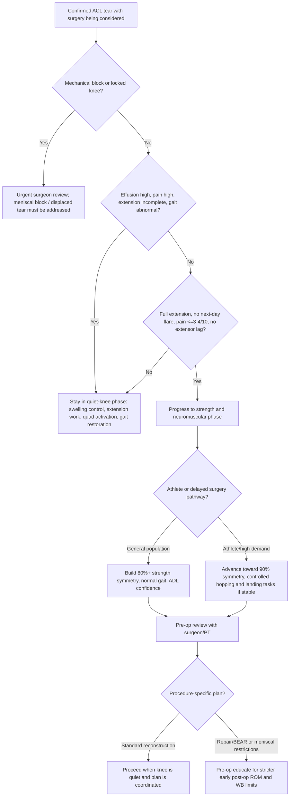
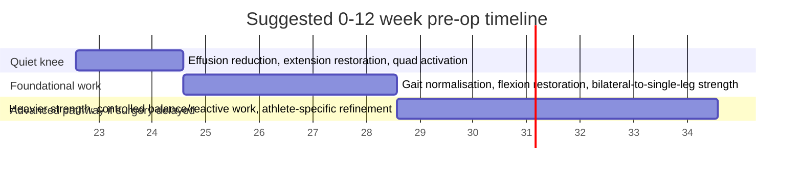
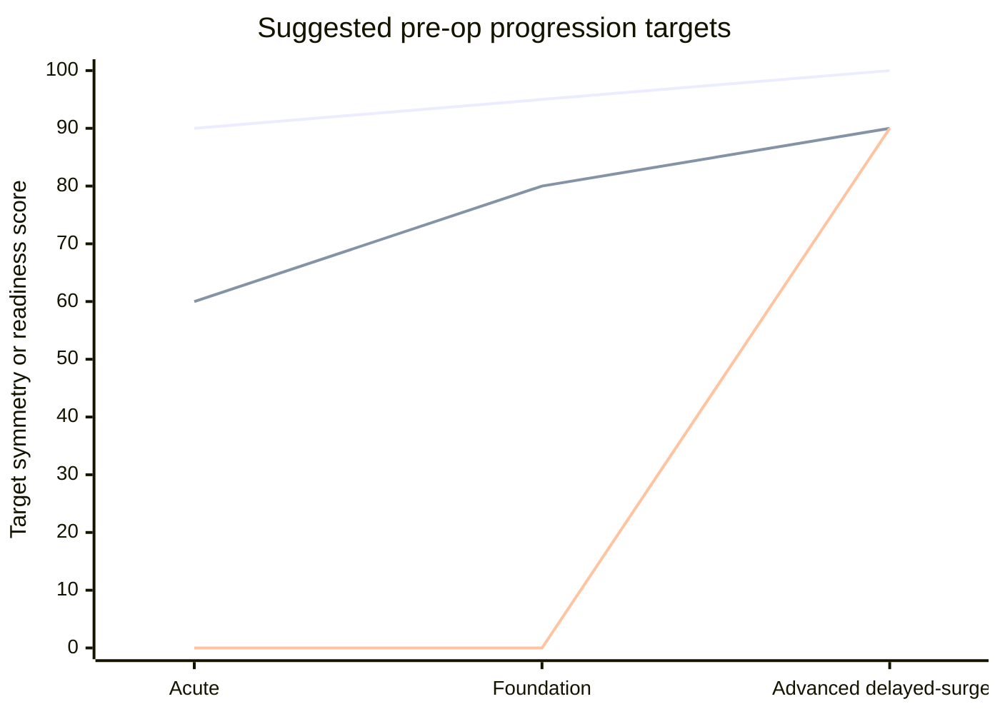

# Evidence-Based Pre-Operation ACL Prehabilitation Reference

## Executive summary

For a person preparing for ACL repair or reconstruction, the most defensible pre-operative priorities are to create a **quiet knee** and a **strong, controllable limb** before the operation: restore **full extension**, regain near-normal gait, reduce effusion and pain, re-establish quadriceps activation, and build as much strength and neuromuscular control as the knee can tolerate without next-day flare. Across recent guidelines, reviews, and trials, those items are the most consistent predictors of smoother early recovery and better function after surgery. citeturn9view0turn6view0turn14search0turn14search1turn40view0

The evidence supporting ACL prehab is now stronger than “do something before surgery”, but still not strong enough to claim one single universally superior protocol. Systematic reviews from 2020 to 2025 conclude that prehab is **safe**, usually improves **pre-operative function**, and can improve **early postoperative quadriceps strength, hop performance, self-reported knee function, and return-to-sport timing or rates**, although exact programme content, duration, and supervision dose remain variable and incompletely defined. citeturn16view0turn17view0turn15view0turn20search0turn43search0

Where surgery is already planned, the best practical synthesis is this: use a **criterion-based** rather than calendar-only approach; progress only when extension is full, swelling is controlled, pain is low, gait is normalising, and exercise is not causing a next-day reaction. A recent randomized trial found that a **guided, criteria-based prehab programme** produced a small but measurable advantage in perceived knee function over self-guided home training, while both groups improved. citeturn35view0turn35view1turn18view3

Surgical timing needs nuance. The 2022 AAOS guideline recommends that, **when reconstruction is indicated for an acute isolated tear**, earlier reconstruction is preferred because the risk of additional meniscal and chondral injury rises within about **three months**, especially in younger and more active patients. At the same time, modern expert commentary and cohort data emphasise that operating on a stiff knee is undesirable; **criterion-based restoration of motion and quadriceps function** matters more than simply chasing the earliest possible date. citeturn5view0turn5view1turn5view3turn14search1turn14search0

For the present report, the patient population is treated as **unspecified**. Recommendations below therefore cover a general adult or skeletally mature population, with explicit adaptations for **athletes/high-demand pivoting sport participants** versus the **general population**. Combined ligament injuries, major meniscal block/repair plans, marked osteoarthritis, paediatric cases, and medically complex patients need surgeon-specific modification. citeturn9view0turn18view3turn32view0

## Evidence synthesis

The current evidence base is led by official and high-level sources rather than by a large number of modern prehab RCTs. The highest-priority guidance in this topic area comes from the **AAOS anterior cruciate ligament clinical practice guideline**, the **MOON rehabilitation framework**, the **Aspetar ACLR rehabilitation guideline**, and the 2016 **van Melick** multidisciplinary ACL rehabilitation guideline. Their common message is that rehabilitation should include a **prehabilitation phase**, use **objective criteria** for progression, and prioritise motion, swelling control, quadriceps function, movement quality, and appropriate strength testing. citeturn3view0turn5view3turn8view0turn9view0turn30search0turn31search10

The 2020 Carter systematic review included three RCTs and found **very low-quality evidence** that prehab programmes containing strength, balance, control, and perturbation components provide a **small benefit** for quadriceps strength and single-leg hop scores around **three months** after ACL reconstruction, while also highlighting major heterogeneity and risk of bias. citeturn16view0

The 2020 Giesche systematic review broadened the lens to six studies and found that prehab was associated with **better pre-reconstruction gains in quadriceps torque**, **better self-reported knee function before surgery and two years after surgery**, and a tendency towards **faster return to sport**, with one study showing higher two-year RTS rates. citeturn17view0

The 2022 Potts systematic review specifically on quadriceps strength concluded that **4–16 weeks** of pre-operative exercise can significantly improve **pre-operative quadriceps strength**, which matters because pre-operative quadriceps strength is itself associated with postoperative strength and function. That links well with the 2020 review by Qiu and colleagues showing **moderate evidence** that stronger quadriceps before surgery predicts better quadriceps strength after surgery, though the exact predictive cut-offs are not yet universal. citeturn20search0turn20search10

The 2022 Cunha review distilled the practical content well: at minimum, ACL prehabilitation should include **quadriceps strengthening**, **range of motion restoration**, and **balance/proprioception**, and when there is a delay between diagnosis and surgery, **4–6 weeks** of prehab can improve early-to-mid-term strength, motion, and return-to-sport timing or likelihood. citeturn43search0turn43search4

The largest recent summary is the 2025 Zakharia systematic review, which included **36 studies** and **2326 patients**. It reported **no pre-operative complications** attributable to prehab, found that current prehab practice emphasises **impairment resolution, ROM restoration, and neuromuscular exercise**, and concluded that prehab appears **safe and effective** for short- to long-term benefits while calling for more high-quality RCTs with clearer exercise details. citeturn15view0

Among individual studies, the 2015 Kim trial reported that **four weeks of pre-operative exercise** improved postoperative recovery of knee extensor strength, while the 2016 Failla comparative effectiveness study found that a cohort undergoing **extended pre-operative strengthening and neuromuscular training** had clinically meaningful improvements in IKDC/KOOS outcomes and a higher return to preinjury sport rate at two years (**72% vs 63%**) compared with the comparator cohort. citeturn21search0turn38search0turn38search4turn38search6

The most up-to-date randomised evidence identified was the 2026 Abel trial. It compared a **guided, structured, individually tailored, criteria-based programme** with a **self-administered home programme** in people aged 16–60 scheduled for hamstring or quadriceps tendon autograft ACL reconstruction. The guided group showed a **more pronounced pre-operative KOOS improvement** and a small advantage up to **60 days postoperatively**; progression in the guided arm required **full active extension**, **no next-day tissue reaction for two consecutive sessions**, and **no painful movement restriction**, using **VAS <3–4** as a practical pain guide. citeturn18view3turn35view0turn35view1turn35view3

Two caveats matter. First, the literature is much stronger on **what the targets should be** than on the exact **sets, reps, weekly frequency, and progression speed**. Aspetar states plainly that exercise is the mainstay, but there is **little evidence on dose-response**. Second, directly pre-op Cochrane guidance is limited; the closest Cochrane products in this topic area are the 2016 review on **surgery versus conservative care** and the 2025 review on **postoperative rehab interventions**, so detailed prehab operational guidance still rests mainly on AAOS, MOON, Aspetar, and non-Cochrane reviews and trials. citeturn9view0turn24search19turn24search11

## Requirements, constraints, red flags, and decision rules

A person is likely to get the most benefit from ACL prehab when these **minimum surgery-readiness requirements** are being approached before the operation: **full passive and active knee extension with no flexion contracture**, **minimal or trace effusion**, **pain low enough to allow quality training**, **normal or near-normal gait**, **no straight-leg-raise extensor lag**, and improving quadriceps strength and control. These are the most repeated themes across MOON, Aspetar, AAOS-adjacent literature, and modern expert reviews. citeturn6view0turn9view0turn39search2turn40view0

A very important constraint is that **full extension is not optional**. The AAOS guideline identifies postoperative loss of motion and arthrofibrosis as meaningful complications, and newer cohort data show that people with **pre-operative loss of extension** are nearly **three times** more likely to still have extension loss at 12 months after reconstruction. A related 2023 commentary argued that optimal timing should depend on **criterion-based return of ROM and quadriceps strength**, not on time alone. citeturn3view3turn14search0turn14search4turn14search1

A second major constraint is that surgery should not simply be delayed indefinitely “for more prehab” in someone who has persistent instability and high activity demands. AAOS recommends that when reconstruction is indicated for an acute isolated tear, **earlier reconstruction** is preferred because the risk of **additional meniscal and cartilage injury** rises within about three months. That matters particularly in **younger and more active** patients. citeturn5view3turn5view0turn5view1

The most important **red flags warranting urgent surgeon review** before continued progression are a **locked knee or mechanical block to motion**, recurrent major giving-way episodes, inability to regain extension, rapidly increasing swelling, suspected fracture/dislocation, neurovascular symptoms, or systemic illness suggesting infection. AAOS specifically notes prompt treatment for ACL tears associated with a **locked knee due to a displaced meniscal tear**, and standard clinician references emphasise rehabilitation to full ROM before surgery to reduce arthrofibrosis risk. citeturn5view2turn39search2turn39search11

The main **relative contraindications or reasons to modify active prehab** are medically unstable cardiovascular or neurological disease, inflammatory/rheumatic conditions that alter load tolerance, pregnancy where exercise intensity or adjuncts need modification, major concomitant injuries that change the postoperative plan, or acute pain/effusion severe enough to prevent quality movement. The 2026 Abel trial excluded severe cardiovascular disease, neurological disorders, rheumatic disease, pregnancy, prior significant knee operations, and concomitant injuries requiring a different rehab course. citeturn18view3

If blood-flow-restriction training is being considered as an adjunct, it should **not** be treated as routine core prehab. In the Aspetar guideline, even for the early postoperative phase it is only suggested as an adjunct and clinicians are warned about contraindications such as **cardiovascular disease, extensive swelling, and skin irritation**. For pre-op use, that caution should be at least as strict. citeturn9view0

The most defensible **decision rules** are shown below.



This decision pathway reflects AAOS timing recommendations, the strong emphasis on extension and criterion-based progression in modern ACL rehabilitation guidance, MOON’s “full extension and normal walking” priorities, and the Abel trial’s progression rules. citeturn5view3turn6view0turn9view0turn35view0turn40view0

## Criterion-based prehab protocol and exercise library

The protocol below is an **evidence-concordant synthesis**, not a claim that one published trial validated every set/repetition exactly as written. The literature strongly supports the **targets and progression logic**; it is weaker on the exact dose. Where official sources provide exact dosage, those figures are used directly, especially from MOON. Where they do not, the programme uses conservative, common-strength-training doses compatible with the evidence and with symptom-response rules. citeturn9view0turn6view0turn35view1

### Core progression rules

Progress only if the person has **full active knee extension**, **no increase in swelling or pain the next day**, **no painful movement restriction**, and acceptable exercise pain, using **VAS under about 3–4/10** as a practical ceiling. If symptoms exceed that, if gait worsens, or if effusion increases above trace, reduce load, cut range, or return to the previous phase for 24–72 hours. citeturn35view0turn35view1turn9view0

### Acute quiet-knee phase

**Primary objective:** reduce swelling and pain, restore extension, regain quadriceps activation, and normalise basic walking mechanics. MOON makes full extension and normal walking the two most critical goals before surgery. citeturn6view0

| Exercise or activity | Suggested dose | Tempo / ROM | Progress when | Regress when | Safety notes |
|---|---:|---|---|---|---|
| Ice, elevation, relative rest | Several times daily in first days as needed | Leg elevated above heart; avoid pillow under knee alone | Effusion and pain settling | Swelling rebounds after activity | Do not immobilise in persistent knee flexion. citeturn6view0 |
| Everyday knee extension / heel prop | 20–30 min, 3–4×/day | Heel supported, knee unsupported | Extension equals contralateral side | Posterior knee pain or guarding increases | Strong priority item before surgery. citeturn6view0turn39search2turn14search0 |
| Prone hang or seated assisted extension | 20–30 min, 3–4×/day or 10–20 reps, 2–3×/day | Controlled, no forced bounce | Extension improves without next-day flare | Increased swelling or sharp joint pain | Avoid aggressive forcing into pain. citeturn6view0 |
| Heel slides | 10–20 reps, 3–4×/day | Smooth flexion-extension; stop at pain | Flexion improves and knee remains quiet | Painful pinch, swelling increase | Slight discomfort may occur; pain should not escalate. citeturn6view0 |
| Ankle pumps | 15 reps hourly | Full ankle ROM | Calf swelling minimal, mobility improves | Calf pain/swelling unexplained | Screen urgent calf symptoms medically. citeturn6view0 |
| Quadriceps sets | 12 reps with 5 s hold, 3×/day | Maximal quad contraction without glute/hamstring substitution | Strong patellar glide and easy contraction | Persistent substitution or pain spike | Foundational exercise for all later progressions. citeturn6view0 |
| Hamstring sets | 12 reps with 6 s hold, 1–3×/day | Mild–moderate pressure only | Posterior chain activates without cramp | Hamstring pain or guarding | Keep intensity submaximal early. citeturn6view0 |
| Co-contraction drill | 12 reps with 5 s hold, 3×/day | Heel dig plus quad set | Weight-bearing control improving | Pain/effusion increase | Useful bridge from table work to gait. citeturn6view0 |
| Straight-leg raise | 12 reps, 3×/day | Slow lift/lower; **no lag** | Can perform no-lag repetitive SLR | Any extensor lag appears | Do not progress load if lag is present. citeturn7view0 |

**Exit criteria for this phase:** full extension or very close to contralateral, minimal/trace effusion, improving flexion, pain low, straight-leg raise without lag, and walking pattern substantially normalised. citeturn6view0turn9view0turn35view1

### Foundational strength and control phase

**Primary objective:** build strength in the quadriceps, hamstrings, calf, hip abductors/extensors, and improve single-leg control while maintaining the quiet knee. This is the phase that most clearly links prehab to later outcomes in the reviews and cohort studies. citeturn17view0turn20search0turn38search4

A practical structure is **2 supervised sessions each week plus 2–3 home sessions**, or—if supervision is limited—**3 structured home sessions weekly** with remote or intermittent monitoring. That closely reflects recent evidence and current guideline pragmatism. citeturn18view3turn9view0

| Exercise | Suggested dose | Tempo / ROM | Progression rule | Regression rule | Safety note |
|---|---:|---|---|---|---|
| Double-leg heel raise | 12 reps, 1–3×/day | **2 s up / brief hold / 4 s down** | Add total reps, then single-leg emphasis | Calf cramp or loss of weight symmetry | Keep motion vertical; avoid rocking. citeturn7view0 |
| Double-leg quarter squat | 2–3 sets of 8–12 reps | Sit back ~6 inches; knees over 2nd–3rd toes | Progress depth and load only if no swelling next day | Weight shift, dynamic valgus, pain >3–4/10 | Mirror feedback is useful. citeturn7view0turn35view1 |
| Side-lying hip abduction | 12 reps, 1–3×/day | Operative leg slightly behind trunk, toes slightly in | Add band or more sets when pelvis stays stable | Hip/back substitution | Key for frontal-plane control. citeturn7view0 |
| Prone or standing hip extension | 12 reps, 1–3×/day | 2 s hold; no trunk rotation | Add band or more range | Low-back pain develops | If back symptoms appear, adjust setup. citeturn7view0 |
| Prone or standing hamstring curl | 12 reps, 1–3×/day | 5 s up, **2–3 s down** | Add band or machine later if tolerated | Posterior knee pain | Be conservative if hamstring autograft is planned and baseline testing is pending. citeturn7view0turn10view0 |
| Bridge or hip bridge | 2–3 sets of 8–12 reps | Controlled pelvis; full hip extension | Progress to single-leg only if pelvis stable and knee quiet | Hamstring cramp or anterior knee pain | Included in recent home-programme comparators. citeturn35view3 |
| Single-leg balance / Y-balance preparation | 2–4 bouts of 20–45 s | Quiet knee, level pelvis | Add reach tasks or perturbation | Recurrent instability or giving way | Balance and proprioception are core prehab components. citeturn16view0turn43search4 |
| Stationary cycling | 10–30 min | Easy–moderate, pain-free | Increase time first, then resistance | Increased effusion next day | Useful for ROM and conditioning once flexion allows. citeturn8view0turn6view0 |

**Exit criteria for this phase:** full extension maintained, flexion near full, gait normal, no or trace effusion, no SLR lag, and at least **~80% quadriceps limb symmetry** if measurable. That 80% level is a sensible minimum because deficits above 20% pre-operatively are associated with worse later outcomes, and Aspetar uses **>80% quadriceps LSI** as a criterion for the later return-to-running milestone after surgery. citeturn30search4turn20search6turn9view0

### Advanced delayed-surgery or athlete phase

This phase is most relevant when surgery is delayed several weeks, or the person is an athlete/high-demand pivoting-sport participant who needs better pre-op reserve. The emphasis is heavier strength, landing and deceleration quality, controlled single-leg work, and psychological confidence—without provoking instability episodes. citeturn17view0turn40view0turn32view0

A practical target is **2 heavy-ish strength sessions**, **1 balance/landing mechanics session**, and **2 low-impact conditioning sessions** weekly. For the general population, 2–3 total strength/control sessions each week are usually sufficient if the knee is quiet; for athletes, more frequent exposure is often appropriate. This difference is an evidence-informed operationalisation of guideline targets rather than a direct trial result. citeturn9view0turn18view3turn8view0

| Exercise | Suggested dose | Tempo / ROM | Progression rule | Regression rule | Safety note |
|---|---:|---|---|---|---|
| Split squat / rear-foot supported split squat | 3 sets of 6–10 | Controlled; stop before pain or instability | Add load only if knee tracks well | Dynamic valgus or next-day effusion | Better for athletes than for early general-pop pathways. |
| Leg press or trap-bar style squat pattern | 3–4 sets of 5–8 | Pain-free working ROM | Progress external load gradually | Anterior knee pain or swelling rise | If surgeon expects meniscal repair or repair/BEAR, confirm post-op transfer plan first. citeturn33view1turn33view2 |
| Step-up / step-down | 2–3 sets of 6–10 | Slow eccentric, level pelvis | Increase step height or add load | Pelvic drop, knee collapse | Strong movement-quality marker. |
| Controlled landing / pogo / snap-down drills | 2–4 sets of 6–10 contacts | Soft, symmetrical landing | Only if knee stable, swelling trace, no giving way | Pain, fear, asymmetrical landing | Use only in advanced pathways; not mandatory for basic surgery readiness. citeturn9view0turn17view0 |
| Perturbation / reactive balance | 10–15 min | Stable trunk, knee control | Add complexity before speed | Recurrent instability | Perturbation is used in many positive prehab studies, though added value over good strengthening programmes remains debated. citeturn16view0turn38search4turn36search11 |

**What should not be present before surgery if full benefit is the goal:** persistent extension loss, moderate-to-large effusion, active giving way during daily activities, an extensor lag, or a purely passive waiting period with no planned training. Those factors either worsen outcomes directly or waste the pre-op window. citeturn14search0turn14search1turn35view0turn38search4

### Annotated exercise library

The MOON pre-surgery exercise page is the most useful official patient-facing library identified because it provides **photos/diagrams**, labels exercises as **primary, alternate, and optional**, and gives practical dosage and safety cues. The table below links the most useful pre-op drills to their purpose. citeturn6view0turn7view0

| Exercise | Why it matters before surgery | Best use case | Key safety note | Best official source |
|---|---|---|---|---|
| Heel prop / passive extension | Prevents flexion contracture; highest-value ROM task | Everyone | Never put the pillow only under the knee | MOON prehab page. citeturn6view0 |
| Heel slides | Restores flexion while maintaining mobility | Acute and foundation phases | Stop at pain, not at mild stretch discomfort | MOON prehab page. citeturn6view0 |
| Quad set | Reverses quadriceps inhibition | Acute phase onward | Avoid glute/hamstring substitution | MOON prehab page. citeturn6view0 |
| Straight-leg raise | Confirms usable quadriceps control | Once quad set is clean | Do not allow extensor lag | MOON prehab page. citeturn7view0 |
| Co-contraction drill | Improves gait-related thigh coordination | Early weight-bearing transition | Don’t push so hard that trunk lifts | MOON prehab page. citeturn6view0 |
| Quarter squat | Restores weight-bearing strength pattern | Foundation phase | Keep weight even; watch valgus | MOON prehab page. citeturn7view0 |
| Side-lying hip abduction | Improves frontal-plane control | Foundation phase | Keep pelvis still; avoid trunk roll | MOON prehab page. citeturn7view0 |
| Single-leg balance | Restores neuromuscular control | Foundation to advanced | Avoid if repeated giving way persists | Used across modern prehab literature. citeturn16view0turn43search4 |

## Testing, milestones, schedules, and visualisations

The most useful pre-op **testing battery** combines motion, swelling, strength, movement quality, and self-report. The 2016 van Melick guideline recommended a battery of **strength tests, hop tests, quality-of-movement assessment, and psychological testing** to guide progression, and the Aspetar guideline similarly embeds objective criteria and PROMs in milestone decisions. citeturn30search0turn9view0

### Target testing battery

| Domain | Minimum practical target before surgery | Advanced athlete / delayed-surgery target | Evidence note |
|---|---|---|---|
| Knee extension ROM | **Equal to contralateral / no flexion contracture** | Same | Strongest pre-op target in the literature. citeturn6view0turn14search0turn39search2 |
| Knee flexion ROM | Near full; ideally within **10–15°** of contralateral or enough for normal cycling/squat pattern | Full or near full | Flexion threshold is less validated than extension; largely protocol-derived. citeturn33view2turn6view0turn14search1 |
| Effusion | None or trace | None or trace | Used by Aspetar and modern protocols as a progression gate. citeturn9view0 |
| Gait | Normal or near-normal without obvious unloading | Normal | MOON treats normal walking as a critical goal. citeturn6view0 |
| Extensor lag | None on straight-leg raise | None | Pre-op control marker and transferability to early post-op rehab. citeturn7view0turn33view1 |
| Quadriceps strength LSI | **≥80%** is a sensible minimum | **≥90%** preferred if surgery is delayed and the knee is stable | >20% deficit is unfavourable; >80% is also used in later running criteria. citeturn30search4turn20search6turn9view0 |
| Hamstring strength LSI | Aim to minimise deficit; **≥80%** is practical | **≥90%** preferred | No universally validated pre-op cut-off identified. Measure and interpret with graft plan. citeturn30search4turn10view0 |
| Hop tests | Not mandatory for basic surgery readiness | If knee is stable, target **≥90% LSI** on hop battery | Useful mainly in athlete / delayed-surgery pathways. citeturn30search0turn9view0 |
| IKDC-SKF | Serial change more important than a day-of-surgery cut-off | Aspirational anchor: **PASS ≈75.9** | PASS is mainly postoperative interpretive, not a firm pre-op gate. citeturn27search2turn27search12 |
| KOOS | Serial change more important than a day-of-surgery cut-off | Aspirational anchors: KOOS Symptoms roughly **73–78**; KOOS-QOL roughly **53–57** | Again mainly PASS context, not a rigid pre-op requirement. citeturn27search13turn27search0 |
| ACL-RSI | Useful if sport return is a goal | **≥65** is a useful longer-term psychological marker | Valid more for later RTS prediction than for surgery-day clearance. citeturn27search8turn27search21 |

A crucial interpretation point is that **PROM thresholds such as IKDC PASS, KOOS PASS, or ACL-RSI ≥65 are better treated as reference anchors than as mandatory pre-operative gates**. They were largely developed for postoperative acceptability or return-to-sport prediction, not specifically for deciding whether a knee is ready to go to theatre. ROM, swelling, gait, quadriceps activation, and strength remain the load-bearing pre-op criteria. citeturn27search2turn27search13turn27search21turn14search0

### Sample weekly schedules

| Population | Mon | Tue | Wed | Thu | Fri | Sat | Sun |
|---|---|---|---|---|---|---|---|
| General population | Supervised or structured strength/control | ROM + bike/walk + quad activation | Home strength/control | Recovery + ROM | Strength/control | Optional easy conditioning | Rest |
| Athlete / high-demand | Heavy strength + landing mechanics | Conditioning + ROM | Supervised strength + balance | Conditioning + movement quality | Heavy strength | Optional field-free agility / balance | Rest or mobility |

This schedule is intentionally criterion-based. If the knee reacts with more swelling, pain, or instability, replace the next planned session with the quiet-knee phase. That is more consistent with the evidence than forcing a fixed calendar. citeturn9view0turn8view0turn35view1

### Milestone timeline



**Milestones by phase:**  
By the end of the quiet-knee phase, the person should be moving towards full extension, minimal swelling, no SLR lag, and substantially improved walking. By the end of the foundational phase, the knee should remain quiet under strengthening loads and quadriceps symmetry should be approaching **80%** if measurable. If surgery is delayed and the knee is stable, the advanced phase aims for **90%+** symmetry targets in athletes, controlled single-leg mechanics, and better psychological confidence. citeturn6view0turn30search4turn9view0turn17view0

### Strength and ROM target chart



This chart is a practical synthesis rather than a literal published graph. It reflects the relative weighting of extension and ROM restoration early, the importance of reaching about **80% quadriceps symmetry** before surgery when possible, and the use of **90%+ strength and functional symmetry** as an advanced athlete target if the knee is stable and surgery is delayed. citeturn30search4turn9view0turn27search21

## Comparative considerations and coordination checklist

### Reconstruction, repair, graft choice, and procedure-specific implications

The AAOS guideline gives a **strong recommendation** that ACL tears indicated for surgery should currently be treated with **reconstruction rather than repair** because of a lower risk of revision surgery. That remains the safest default assumption for pre-op planning. citeturn3view0turn4view1

Repair-based pathways still matter because they change education and expectations. The AOSSM 2024 review notes that ACL repair is mainly considered for **proximal tears**, especially Sherman type I or II tears, while midsubstance and most distal tears are poor repair candidates. It also notes that high-demand populations such as collegiate, semi-professional, professional athletes, and military members still lack enough evidence to support broad repair adoption. citeturn32view0

For the person doing prehab, the most relevant implication is that **postoperative restrictions differ**. The official BEAR protocol explicitly states that BEAR is **not an ACL reconstruction** and has a different rehabilitation pathway, with **partial weight-bearing**, brace protection, and early ROM limits. That means pre-op education should include the likely first six postoperative weeks, not just the surgery date. citeturn33view0turn33view1turn33view2

Graft planning also matters. AAOS recommends that, when reconstruction is performed, surgeons should consider **autograft over allograft**, particularly in young and/or active patients, because of lower failure rates. For autograft source, BTB may reduce graft failure or infection risk, whereas hamstring grafts may reduce anterior or kneeling pain. Pre-op training should therefore document baseline quadriceps and hamstring function carefully, because harvest-site morbidity influences the postoperative deficit profile. citeturn10view0turn10view1

| Issue | Reconstruction default | Repair / BEAR implication |
|---|---|---|
| Current evidence position | Standard of care for tears requiring surgery | Selected cases only; revision risk remains a concern overall. citeturn3view0turn32view0 |
| Best candidates | Broad range depending on age, goals, instability, activity | Mostly proximal tears with repairable tissue. citeturn32view0 |
| Early postop expectation to teach pre-op | Usually immediate ROM and progressive loading within surgeon protocol | Often stricter early WB and ROM controls; BEAR has explicit early restrictions. citeturn9view0turn33view1turn33view2 |
| Prehab emphasis | Quiet knee, extension, strength reserve, PROM baseline | Same, but add stronger patient education on protection phase. citeturn33view0turn6view0 |

### Supervised versus self-managed prehab

The best available evidence suggests that **supervised or at least monitored** prehab is preferable when possible, especially for athletes, people with extension loss, poor quadriceps activation, high fear, or recurrent swelling. The recent 2026 RCT found a small advantage for guided training over self-guided home training, and Aspetar recommends that even unsupervised programmes should be **individually prescribed and monitored**. citeturn18view3turn35view1turn9view0

| Format | Advantages | Drawbacks | Best fit |
|---|---|---|---|
| Supervised, criterion-based | Better movement quality, easier progression/regression, better monitoring of extension, effusion, and fear | Cost, travel, access | Athletes, difficult knees, complex cases. citeturn18view3turn9view0 |
| Hybrid | Good compromise; clinician sets plan and checks metrics | Requires adherence and self-monitoring | Most general patients with some PT access. citeturn9view0turn8view0 |
| Self-managed only | Lower cost, accessible | Higher risk of under-loading, over-loading, or poor technique | Only when access is limited and follow-up is still possible. citeturn9view0turn18view3 |

### Risk mitigation and surgeon–PT coordination checklist

Use this checklist before the operation:

| Item | Why it matters |
|---|---|
| Confirm exact procedure: reconstruction, repair, or BEAR | Pre-op education and postop restrictions differ. citeturn33view0turn32view0 |
| Confirm graft choice if reconstruction is planned | Influences expected early deficits and baseline testing priorities. citeturn10view0 |
| Document extension, flexion, effusion, gait, extensor lag, strength, IKDC/KOOS, and ACL-RSI if relevant | Creates a real baseline and makes progression criterion-based. citeturn30search0turn9view0 |
| Teach the immediate postoperative home programme pre-op | Official BEAR guidance explicitly asks this; good practice more broadly. citeturn33view1 |
| Schedule first PT visit within the first postoperative week | Explicit in BEAR guidance and aligns with modern rehab principles. citeturn33view1 |
| Clarify meniscal status and any need for preservation/repair | Meniscal decisions alter loading and ROM plans. citeturn5view2turn32view0 |
| Screen for extension loss or locked knee | High-value risk mitigation for stiffness and meniscal block. citeturn14search0turn5view2 |
| Do not allow surgery-day enthusiasm to override the quiet-knee criteria | The stiff knee is a known risk state. citeturn14search1turn39search2 |

## Machine-readable handoff, annotated bibliography, and source URLs

### JSON handoff schema and starter instance

```json
{
  "protocol_id": "acl_prehab_preop_reference_v1_enGB",
  "metadata": {
    "title": "Evidence-based pre-operation ACL prehabilitation reference",
    "language": "en-GB",
    "date_generated": "2026-06-11",
    "population": "Unspecified; assumes skeletally mature adolescent/adult unless surgeon specifies otherwise",
    "scope": ["ACL reconstruction", "ACL repair", "BEAR repair education"],
    "evidence_priority": ["AAOS", "MOON", "Aspetar", "Cochrane context", "PubMed-indexed systematic reviews", "RCTs"]
  },
  "core_targets": {
    "quiet_knee": {
      "effusion": "none_or_trace",
      "pain_vas_max_during_training": 4,
      "gait": "normal_or_near_normal",
      "extension": "equal_to_contralateral",
      "extensor_lag": false
    },
    "strength_targets": {
      "quadriceps_lsi_minimum": 80,
      "quadriceps_lsi_advanced_athlete": 90,
      "hamstring_lsi_pragmatic_minimum": 80,
      "hamstring_lsi_advanced_athlete": 90
    },
    "function_targets": {
      "hop_lsi_advanced_only": 90,
      "prom_reference_anchors": {
        "ikdc_pass_reference": 75.9,
        "acl_rsi_reference_for_same_sport_return": 65
      }
    }
  },
  "decision_nodes": [
    {
      "id": "locked_knee_check",
      "question": "Is there a locked knee or mechanical block to motion?",
      "if_yes": "urgent_surgeon_review",
      "if_no": "quiet_knee_assessment"
    },
    {
      "id": "quiet_knee_assessment",
      "question": "Is there high effusion, high pain, incomplete extension, or abnormal gait?",
      "if_yes": "acute_quiet_knee_phase",
      "if_no": "progression_readiness_check"
    },
    {
      "id": "progression_readiness_check",
      "question": "Is active extension full, pain <= 3-4/10, no next-day flare for two sessions, and no painful restriction?",
      "if_yes": "foundation_strength_control_phase",
      "if_no": "acute_quiet_knee_phase"
    }
  ],
  "phases": [
    {
      "name": "acute_quiet_knee_phase",
      "entry_criteria": ["new ACL injury or reactive knee", "effusion/pain or extension loss"],
      "goals": ["restore extension", "reduce swelling", "recover quad activation", "normalise gait"],
      "exercises": [
        {"name": "heel_prop", "dose": "20-30 min, 3-4x/day"},
        {"name": "heel_slides", "dose": "10-20 reps, 3-4x/day"},
        {"name": "quad_sets", "dose": "12 reps with 5 s hold, 3x/day"},
        {"name": "hamstring_sets", "dose": "12 reps with 6 s hold, 1-3x/day"},
        {"name": "slr_no_lag", "dose": "12 reps, 3x/day when available"}
      ],
      "progress_when": [
        "full_or_near_full_extension",
        "effusion_none_or_trace",
        "pain_controlled",
        "no_extensor_lag",
        "gait_normalising"
      ]
    },
    {
      "name": "foundation_strength_control_phase",
      "entry_criteria": ["quiet knee", "full active extension", "no next-day flare"],
      "goals": ["increase quadriceps strength", "build hip/calf/hamstring support", "improve single-leg control"],
      "schedule": "2 supervised + 2-3 home sessions/week if possible",
      "exercises": [
        {"name": "quarter_squat", "dose": "2-3 sets of 8-12"},
        {"name": "heel_raise", "dose": "12 reps, 1-3x/day", "tempo": "2 up, brief hold, 4 down"},
        {"name": "side_lying_hip_abduction", "dose": "12 reps, 1-3x/day"},
        {"name": "bridge", "dose": "2-3 sets of 8-12"},
        {"name": "single_leg_balance", "dose": "2-4 bouts of 20-45 s"}
      ],
      "progress_when": [
        "full_extension_maintained",
        "flexion_near_full",
        "gait_normal",
        "quadriceps_lsi_approaching_80_if_tested"
      ]
    },
    {
      "name": "advanced_delayed_surgery_or_athlete_phase",
      "entry_criteria": ["stable knee", "quiet knee", "foundational strength established"],
      "goals": ["raise strength reserve", "improve movement quality", "prepare athlete for better postop reserve"],
      "exercises": [
        {"name": "split_squat", "dose": "3 sets of 6-10"},
        {"name": "step_down", "dose": "2-3 sets of 6-10"},
        {"name": "reactive_balance", "dose": "10-15 min"},
        {"name": "controlled_landing", "dose": "2-4 sets of 6-10 contacts if stable"}
      ],
      "progress_when": [
        "quadriceps_lsi_90_if_possible",
        "hop_lsi_90_if_used",
        "no_instability_episodes"
      ]
    }
  ],
  "red_flags": [
    "locked_knee",
    "recurrent_major_giving_way",
    "persistent_extension_loss",
    "rapidly_increasing_effusion",
    "suspected_fracture_or_dislocation",
    "neurovascular_symptoms",
    "systemic_infection_symptoms"
  ],
  "relative_contraindications": [
    "uncontrolled_cardiovascular_or_neurological_disease",
    "active_rheumatic_flare_or_medically_unstable_state",
    "pregnancy_if_high_load_or_adjuncts_not_cleared",
    "concomitant_injuries_changing_rehab_pathway"
  ],
  "procedure_specific_flags": [
    {
      "procedure": "reconstruction",
      "notes": ["confirm graft choice", "capture baseline quad and hamstring strength"]
    },
    {
      "procedure": "repair_or_bear",
      "notes": ["educate stricter early postop WB and ROM limits", "share exact surgeon protocol before surgery"]
    }
  ],
  "tests": [
    {"name": "extension_rom", "threshold": "equal_to_contralateral"},
    {"name": "flexion_rom", "threshold": "near_full_or_within_10_to_15_deg"},
    {"name": "effusion", "threshold": "none_or_trace"},
    {"name": "quadriceps_lsi", "threshold_min": 80, "threshold_advanced": 90},
    {"name": "ikdc", "reference_anchor": 75.9},
    {"name": "acl_rsi", "reference_anchor": 65}
  ],
  "source_keys": [
    "AAOS_ACL_CPG_2022",
    "MOON_PREHAB_2026",
    "ASPETAR_CPG_ACLR_2023",
    "VAN_MELICK_2016",
    "CARTER_2020",
    "GIESCHE_2020",
    "CUNHA_2022",
    "ZAKHARIA_2025",
    "ABEL_2026",
    "AAOS_OrthoInfo_ACL",
    "AOSSM_REPAIR_VS_RECON_2024",
    "MIACH_BEAR_PROTOCOL_2024_2025"
  ]
}
```

The object above is designed to be directly usable for AI workflow ingestion, clinical decision support prototyping, or further transformation into app logic. It preserves the report’s main decision nodes, targets, contraindications, procedure-specific modifiers, and source map. The evidence basis is the guideline-and-review synthesis in this report. citeturn3view0turn6view0turn9view0turn15view0turn18view3

### CSV schema for protocol steps

```csv
phase,step_id,exercise,goal,dose,tempo_or_rom,entry_criteria,progression_rule,regression_rule,safety_note,source_key
acute_quiet_knee_phase,A1,heel_prop,restore_extension,"20-30 min 3-4x/day","heel supported knee unsupported","extension_loss_or_effusion","extension equals contralateral and no next-day flare","posterior pain or swelling increase","do not place pillow under knee only",MOON_PREHAB_2026
acute_quiet_knee_phase,A2,heel_slides,restore_flexion,"10-20 reps 3-4x/day","smooth flexion-extension","pain_controlled_enough_to_move","flexion improves without flare","pain spike or effusion increase","mild discomfort acceptable, pain is not",MOON_PREHAB_2026
acute_quiet_knee_phase,A3,quad_sets,restore_quad_activation,"12 reps 5s hold 3x/day","isometric full available extension","quad_inhibition_present","easy activation and no substitution","persistent substitution","focus on quadriceps not glute/hamstrings",MOON_PREHAB_2026
foundation_strength_control_phase,F1,quarter_squat,weight_bearing_strength,"2-3 sets 8-12","quarter depth knees over 2nd-3rd toes","quiet_knee_and_full_extension","no next-day flare and good alignment","dynamic valgus or pain >3-4/10","use mirror if available",MOON_PREHAB_2026
foundation_strength_control_phase,F2,heel_raise,calf_strength,"12 reps 1-3x/day","2 up brief hold 4 down","tolerates standing load","able to keep motion vertical and symmetrical","cramp or asymmetry","avoid rocking forward",MOON_PREHAB_2026
foundation_strength_control_phase,F3,single_leg_balance,neuromuscular_control,"2-4 bouts 20-45s","single-leg stance stable pelvis","quiet_knee_no_giving_way","add reach or perturbation when stable","recurrent instability","not mandatory if knee unstable",GIESCHE_2020
advanced_delayed_surgery_or_athlete_phase,D1,split_squat,advanced_strength,"3 sets 6-10","controlled full pain-free ROM","stable_knee_and_foundation_complete","increase load when alignment and symptoms stay good","effusion or valgus","athlete/high-demand use case",ASPETAR_CPG_ACLR_2023
advanced_delayed_surgery_or_athlete_phase,D2,controlled_landing,high_demand_function,"2-4 sets 6-10 contacts","soft symmetrical landing","stable_knee_no_effusion","retain quality and no next-day response","pain or instability","advanced pathway only",ASPETAR_CPG_ACLR_2023
all,TEST1,extension_rom,objective_test,"1 measure/session","goniometric or clinical side comparison","baseline_and_recheck","equal_to_contralateral","new_loss_of_extension","highest-value pre-op metric",AAOS_ACL_CPG_2022
all,TEST2,quadriceps_lsi,objective_test,"1 formal test when feasible","isokinetic or dynamometry","quiet_knee_and_safe_testing","minimum 80 advanced 90","drop in symmetry with flare","interpret alongside graft plan",VAN_MELICK_2016
```

### Annotated bibliography

**AAOS Clinical Practice Guideline on Management of ACL Injuries.** Most important current official source for surgical timing, graft choice, and the strong recommendation favouring reconstruction over repair when surgery is indicated. It is the anchor source for timing and procedure-selection decisions. citeturn3view0turn5view3turn10view0

**MOON Knee Group pre-surgery ACL rehabilitation guidance.** Best practical official exercise reference found for day-to-day prehab, with explicit doses for extension work, heel slides, quad sets, hamstring sets, SLRs, heel raises, quarter squats, and hip work. citeturn6view0turn7view0

**Aspetar clinical practice guideline on rehabilitation after ACLR.** Strong modern reference for criterion-based progression, objective milestone criteria, and pragmatic advice on supervised versus unsupervised rehabilitation. It also explicitly mentions at least one preoperative visit to ensure no flexion contracture and adequate voluntary muscle activation. citeturn9view0

**van Melick et al. 2016 guideline.** Important because it formally places **prehabilitation** inside the ACL rehabilitation pathway and recommends a battery of strength, hop, movement-quality, and psychological tests for progression. citeturn30search0turn31search10

**Carter et al. 2020 systematic review.** Useful for showing the limits of the evidence: small benefits on early function are plausible, but the RCT base was small and at high risk of bias. citeturn16view0

**Giesche et al. 2020 systematic review.** Strengthens the case for prehab by showing better neuromuscular function, self-reported outcomes, and likely return-to-sport benefit. citeturn17view0

**Cunha and Solomon 2022 review.** Clinically useful distillation of “what should be in prehab”: quadriceps strengthening, ROM restoration, and balance/proprioception, usually over roughly 4–6 weeks when surgery is delayed. citeturn43search0turn43search4

**Failla et al. 2016 comparative study.** One of the strongest medium-term clinical arguments for prehab, showing better two-year outcomes and higher return-to-sport rates in the cohort that received extended pre-op strengthening and neuromuscular training. citeturn38search0turn38search4turn38search6

**Abel et al. 2026 randomised trial.** Most current randomised evidence identified. Particularly useful for its operational progression rules: full active extension, no next-day reaction on two sessions, no painful movement restriction, and practical pain guidance. citeturn18view3turn35view1

**AOSSM 2024 review on ACL repair versus reconstruction and the Miach BEAR protocol.** Together, these are the best practical sources for understanding when repair is considered, why reconstruction remains the standard of care, and how procedure-specific early postoperative restrictions should be taught before surgery. citeturn32view0turn33view0turn33view1turn33view2

### Source URLs

```text
https://www.aaos.org/globalassets/quality-and-practice-resources/anterior-cruciate-ligament-injuries/aclcpg.pdf
https://orthoinfo.aaos.org/en/diseases--conditions/anterior-cruciate-ligament-acl-injuries/
https://acltear.info/anterior-cruciate-ligament-rehabilitation/acl-prehab/
https://acltear.info/anterior-cruciate-ligament-rehabilitation/
https://www.aspetar.com/en/professionals/aspetar-clinical-guidelines/recommendations-on-rehabilitation-after-aclr
https://pubmed.ncbi.nlm.nih.gov/33010802/
https://pubmed.ncbi.nlm.nih.gov/33112865/
https://pubmed.ncbi.nlm.nih.gov/34933208/
https://pubmed.ncbi.nlm.nih.gov/35141537/
https://pubmed.ncbi.nlm.nih.gov/40276858/
https://pubmed.ncbi.nlm.nih.gov/27416993/
https://www.nature.com/articles/s41598-026-41576-2
https://pubmed.ncbi.nlm.nih.gov/36846811/
https://pubmed.ncbi.nlm.nih.gov/37286287/
https://www.sportsmed.org/membership/sports-medicine-update/fall-2024/acl-repair-vs-reconstruction-is-less-more
https://miachortho.com/wp-content/uploads/2025/02/ML-1014-Rev-J-BEAR-Rehab-Protocol.pdf
https://www.cochrane.org/evidence/CD011166_surgical-versus-conservative-interventions-treating-anterior-cruciate-ligament-injuries
https://www.cochranelibrary.com/cdsr/doi/10.1002/14651858.CD016067/related-content
https://pubmed.ncbi.nlm.nih.gov/41186026/
```

### Open questions and limitations

The modern prehab evidence base is still smaller than the importance of the problem would justify. Exact pre-op **dose-response**, the ideal mix of supervised versus hybrid care, and truly validated **pre-operative cut-offs** for strength, hop tests, and PROMs remain incompletely settled. Several useful thresholds in current practice are extrapolated from postoperative or return-to-sport literature rather than being validated specifically for the **day before surgery**. Repair and BEAR pathways are also evolving, and the strongest official guideline still favours reconstruction over repair when surgery is indicated. citeturn9view0turn15view0turn18view3turn3view0

The safest way to use this reference is therefore as a **criterion-based framework** for surgeon–physiotherapist planning and for AI handoff, not as a substitute for procedure-specific restrictions from the operating surgeon. That is especially important for combined injuries, meniscal block or repair, paediatric cases, and medically complex patients. citeturn33view0turn5view2turn18view3